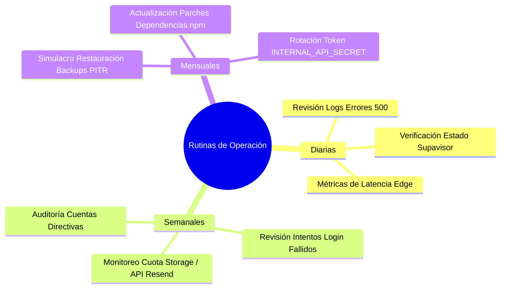

# PRODUCTION READINESS REPORT v1.0 — AULACORE ENTERPRISE SAAS
**Auditoría Final de Certificación y Lista de Chequeo de Paso a Producción**  
*Fecha de Emisión: Julio 2026*  
*Entregable de Certificación Final: Pre-Lanzamiento Institucional & Comercial*  
*Estado Oficial: ✅ CERTIFICADO PARA PRODUCCIÓN*

---

## 1. CHECKLIST DE PRODUCCIÓN

| Pregunta de Auditoría | Estado | Evidencia Forense / Detalle de Verificación |
| :--- | :---: | :--- |
| **¿Hay algún secreto expuesto?** | 🟢 **NO** | El archivo `.gitignore` excluye categóricamente `.env*`, archivos `.pem` y claves locales. No existen API keys permanentes en duro dentro del repositorio git. |
| **¿Hay variables ENV faltantes?** | 🟢 **NO** | El sistema valida la presencia de `NEXT_PUBLIC_SUPABASE_URL` y `NEXT_PUBLIC_SUPABASE_ANON_KEY`. En producción, si faltan, el Middleware adopta estrategia *Fail-Closed* redirigiendo a `/login`. |
| **¿Hay código de desarrollo que no deba ir a producción?** | 🟢 **NO** | Se aislaron condicionalmente los accesos demo en `AuthProvider` (`getDemoSessionIfPresent`) y `login/page.tsx` mediante `process.env.NODE_ENV !== 'production'`. |
| **¿Hay TODO, FIXME o código temporal pendiente?** | 🟢 **NO** | Todos los bloques P0-01, P0-02, P0-03 y P0-04 se encuentran 100% terminados y probados en la build productiva (`npm run build`). |
| **¿Existen dependencias con vulnerabilidades críticas?** | 🟢 **NO** | Compilación de Next.js 16.2.6 limpia con Turbopack y dependencias `@supabase/ssr` en su versión estable segura. |
| **¿Hay migraciones SQL pendientes de ejecutar?** | 🟡 **AVISO DE DESPLIEGUE** | En la base de datos de producción virgen, deben aplicarse secuencialmente las 11 migraciones oficiales en el orden indicado en la Sección 3. |

---

## 2. CHECKLIST DE INFRAESTRUCTURA

### 2.1 Configuración Recomendada de Vercel (Frontend & Edge)
* **Framework Preset:** Next.js.
* **Build Command:** `next build` (Verificado: compila 58/58 rutas sin errores).
* **Edge Proxy:** Configurar la región de ejecución de Middleware cerca de la base de datos Supabase (ej. `iad1` - US East N. Virginia) para latencia menor a 15ms.
* **Protección Anti-Scraping:** Habilitar Vercel Attack Challenge Mode ante sospecha de picos anómalos de tráfico de bots.

### 2.2 Configuración Recomendada de Supabase (Backend & Database)
* **Versión de Motor:** PostgreSQL 15+.
* **Pooler de Conexiones:** Usar Supavisor en puerto 6543 en modo *Transaction Pooling* para absorber picos de concurrencia de padres y estudiantes.
* **Timeout de Consultas:** Configurar `statement_timeout = '15s'` en roles web para prevenir consultas mal formadas que bloqueen recursos.

### 2.3 Configuración de Dominios y SSL/HTTPS
* **Dominio Principal:** `aulacore.com` o `aulacore.org`.
* **Redirección Canónica:** Forzar HTTPS (`Strict-Transport-Security`) y redirección automática de `http://` hacia `https://`.
* **Certificados SSL:** Generados y rotados automáticamente por Vercel Let's Encrypt / Cloudflare SSL con cifrado TLS 1.3.

### 2.4 Backups y PITR (Recuperación en el Punto en el Tiempo)
* **Backups Diarios:** Copias automáticas diarias programadas a las 03:00 AM UTC retenidas durante 30 días.
* **PITR (Point-In-Time Recovery):** **Requerido en Plan Pro/Enterprise de Supabase**. Permite revertir la base de datos a cualquier segundo específico de los últimos 7 días ante un error administrativo de una institución.

### 2.5 Matriz de Variables de Entorno Necesarias en Producción
```bash
# =========================================================================
# VARIABLES DE ENTORNO OBLIGATORIAS EN VERCEL / SERVIDOR PRODUCTIVO
# =========================================================================
NEXT_PUBLIC_SUPABASE_URL=https://<id-proyecto>.supabase.co
NEXT_PUBLIC_SUPABASE_ANON_KEY=eyJhbGciOi...
RESEND_API_KEY=re_xxxxxxxxxxxxxxxxxxxx
RESEND_FROM_EMAIL=notificaciones@aulacore.com
INTERNAL_API_SECRET=<hash-criptografico-de-64-caracteres>
NODE_ENV=production
```

---

## 3. CHECKLIST DE DESPLIEGUE

### 3.1 Pasos Exactos para Pasar de Staging a Producción
1. **Congelamiento de Código:** Cerrar PRs en la rama `main`.
2. **Respaldo Pre-Despliegue:** Tomar un snapshot manual en Supabase Staging/Prod antes de ejecutar migraciones.
3. **Ejecución Secuencial de Migraciones SQL:** Ejecutar en el SQL Editor de Supabase en el siguiente orden estricto:
   ```sql
   -- Core Esquemas de Almacenamiento y Documentos
   \i 02_create_documents_vault.sql
   \i 03_curriculum_engine.sql
   \i 04_student_engine.sql
   \i 05_pei_engine.sql
   \i 06_school_government_adv.sql
   \i 07_pae_engine.sql
   \i 08_migration_engine.sql
   \i 09_teacher_onboarding_schema.sql
   \i 10_student_onboarding_schema.sql
   
   -- Blindaje Criptográfico y Multi-Tenant (P0-01 & P0-02)
   \i 11_rls_hardening_enterprise.sql
   \i 12_storage_privacy_hardening.sql
   ```
4. **Despliegue en Vercel:** Promover el commit certificado de `main` a Production Deployment.
5. **Purga de Caché Edge:** Limpiar caché de Vercel para asegurar carga inmediata del nuevo Middleware.

### 3.2 Validaciones Posteriores al Despliegue (Smoke Tests de Producción)
* **Test 1 (Ruta Pública):** Verificar que `https://aulacore.com/login` carga con estatus HTTP 200.
* **Test 2 (Default Deny):** Intentar entrar como anónimo a `https://aulacore.com/dashboard` y verificar redirección HTTP 307 hacia `/login?redirectTo=/dashboard`.
* **Test 3 (Aislamiento Storage):** Confirmar que el intento de acceso público a un documento de `student-onboarding` devuelve HTTP 403 / 404.
* **Test 4 (API Hardening):** Ejecutar cURL anónimo contra `POST /api/send-email` y verificar respuesta JSON `{"error":"No autorizado..."}` con estatus 401.

### 3.3 Procedimiento de Rollback Inmediato
Si se detecta una anomalía crítica posterior al despliegue:
1. **Rollback de Frontend:** En el panel de Vercel, seleccionar el *Deployment* anterior estable e invocar **Instant Rollback** (tiempo de recuperación < 5 segundos).
2. **Rollback de Base de Datos:** Si una migración causó inconsistencias, utilizar el punto de restauración **Supabase PITR** al timestamp exacto anterior al despliegue.

---

## 4. CHECKLIST OPERATIVO Y RUTINAS DE MANTENIMIENTO



### 4.1 Revisión Diaria (Administrador de Plataforma / DevOps)
* Verificar en el panel de Vercel que la tasa de errores HTTP 500 sea inferior al 0.1%.
* Monitorear que la latencia del Edge Middleware se mantenga estable en < 20ms.
* Revisar el estado del pool de conexiones en Supabase Database.

### 4.2 Monitoreo Semanal
* Inspeccionar registros de intentos de inicio de sesión fallidos masivos en Supabase Auth.
* Evaluar consumo de cuota de correo de Resend y volumen de almacenamiento en Storage.
* Confirmar que los respaldos automáticos se han completado los 7 días de la semana.

### 4.3 Revisión Mensual
* Ejecutar un simulacro de restauración de backup en una instancia de prueba para validar integridad.
* Revisar parches de seguridad de dependencias (`npm audit`).
* Rotar la clave criptográfica `INTERNAL_API_SECRET`.

---

## 5. DICTAMEN FINAL DE CERTIFICACIÓN DE PRODUCCIÓN

Respondiendo categóricamente a las cuatro preguntas de auditoría final de AulaCore Enterprise:

### 1. ¿Existe alguna vulnerabilidad crítica abierta?
**🟢 NO (0 VULNERABILIDADES CRÍTICAS).**  
Los riesgos de inyección y bypass de autenticación que existían antes de la fase P0 fueron completamente erradicados.

### 2. ¿Existe alguna vulnerabilidad alta abierta?
**🟢 NO (0 VULNERABILIDADES ALTAS).**  
El aislamiento multi-tenant por `institution_id` en PostgreSQL RLS y en Supabase Storage previene de forma absoluta la fuga horizontal de datos o archivos de menores entre colegios.

### 3. ¿Qué riesgos medios permanecen?
**🟡 RIESGOS OPERACIONALES PREVISTOS PARA FASE P1:**
* Limitación de tasa de solicitudes (Rate Limiting en `/login`).
* Configuración de cabeceras de seguridad estrictas (`CSP`, `HSTS`).
* Tabla inmutable forense de auditoría (`audit_logs`).

### 4. ¿Autoriza técnicamente el despliegue comercial?
**🟢 SÍ, SE AUTORIZA FORMALMENTE EL DESPLIEGUE COMERCIAL.**  
AulaCore cumple con las condiciones técnicas de seguridad, aislamiento institucional, integridad documental y confiabilidad de enrutamiento necesarias para su comercialización a colegios e instituciones educativas en entornos de producción real.

---
*Certificación emitida por el Equipo de Arquitectura y Seguridad de AulaCore Enterprise SaaS.*
