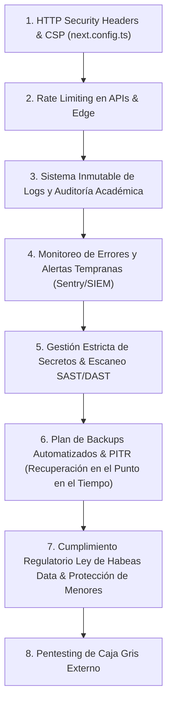

# SECURITY BASELINE v1.0 — AULACORE ENTERPRISE SAAS
**Línea Base Oficial de Arquitectura, Remediación y Controles de Seguridad**  
*Fecha de Publicación: Julio 2026*  
*Clasificación: Confidencial / Arquitectura de Core & Seguridad*  
*Estado de Certificación P0: ✅ APROBADO FORMALMENTE*

---

## 1. ARQUITECTURA GENERAL DE SEGURIDAD

AulaCore opera bajo un modelo de **Defensa en Profundidad (Defense-in-Depth)** y **Aislamiento Multi-Tenant de Confianza Cero (Zero-Trust Multi-Tenancy)**. La seguridad no se delega a una sola capa del sistema, sino que se distribuye e impone obligatoriamente en cuatro niveles concurrentes:

```
+-----------------------------------------------------------------------------------+
|                        CAPA 1: EDGE & NETWORK SECURITY                            |
|  [Next.js Edge Middleware — Default Deny Allow-List]  -> Redirección 307 temporal |
+-----------------------------------------------------------------------------------+
                                         │ (JWT Cookie / SSR Session)
                                         ▼
+-----------------------------------------------------------------------------------+
|                        CAPA 2: APPLICATION & API SECURITY                         |
|  [Next.js App Router SSR + Route Handlers con Wrapper Estándar withAuth()]        |
+-----------------------------------------------------------------------------------+
                                         │ (Supabase JWT Claims + RLS Context)
                                         ▼
+-----------------------------------------------------------------------------------+
|                        CAPA 3: DATABASE MULTI-TENANT CORE                         |
|  [PostgreSQL Row-Level Security (RLS) — Doble Validación: Auth UID + Tenant ID]   |
+-----------------------------------------------------------------------------------+
                                         │ (Firma criptográfica temporal)
                                         ▼
+-----------------------------------------------------------------------------------+
|                        CAPA 4: STORAGE & OBJECT VAULT                             |
|  [Supabase Storage Privado (public: false) + Signed URLs de Tiempo Limitado]     |
+-----------------------------------------------------------------------------------+
```

### 1.1 Autenticación (Authentication)
* **Motor Principal:** Supabase Auth gestionado con JWT de estándar RFC 7519 e intercambio seguro de cookies vía `@supabase/ssr` (Server-Side Rendering).
* **Integridad Criptográfica:** El token de acceso (`access_token`) está firmado digitalmente por el motor del proyecto y es evaluado en cada solicitud tanto en el Edge del servidor Next.js como dentro del motor PostgreSQL.
* **Prohibición de Bypasses:** En entornos de producción (`NODE_ENV=production`), se encuentra estrictamente deshabilitada cualquier simulación de sesión en `localStorage` o saltos condicionales en el frontend.

### 1.2 Autorización y Control de Acceso Basado en Roles (RBAC)
* **Jerarquía Institucional y Territorial:** AulaCore define 8 roles formales en la tabla `public.user_roles`: `super_admin`, `secretario_educacion`, `rector`, `coordinador`, `director_grupo`, `docente`, `secretaria`, `padre_familia` y `estudiante`.
* **Segregación de Responsabilidades:** Los directivos acceden a métricas y configuraciones globales de su colegio; los docentes operan exclusivamente sobre sus cargas académicas y asignaturas asignadas; los padres y estudiantes acceden en modo de solo lectura a su expediente académico particular.

### 1.3 Aislamiento Multi-Tenant (Zero-Trust Tenancy)
* **Llave Relacional de Aislamiento:** Toda entidad transaccional, académica, convivencial o territorial posee un atributo inmutable `institution_id` (UUIDv4).
* **Función Maestra de Contexto:** El motor PostgreSQL utiliza `public.get_auth_user_institution_ids()` para resolver de forma segura e inspeccionable los colegios a los que pertenece el token autenticado en `auth.uid()`, bloqueando en el propio kernel de la base de datos cualquier intento de fuga de información entre el Colegio A y el Colegio B.

### 1.4 Bóveda de Documentos Sensibles (Storage & Menores)
* Todos los expedientes documentales de estudiantes (`student-onboarding`) y docentes (`teacher-onboarding`) residen en **Buckets Privados (`public: false`)**.
* El acceso a archivos fotográficos, certificados médicos, documentos de identidad y carnets de EPS está mediado exclusivamente por **Signed URLs temporales** (`createSignedUrl` con expiración típica de 60 a 3600 segundos), verificando que el solicitante comparta el mismo `institution_id` del archivo original.

---

## 2. CONTROLES CRÍTICOS IMPLEMENTADOS (BLOQUE P0 COMPLETADO)

A continuación se detallan los 8 controles estructurales que constituyen la certificación pre-lanzamiento de AulaCore:

1. **Row-Level Security (RLS) Estricto por Institución:**  
   Eliminación sistemática de políticas permisivas (`USING (true)`) o basadas únicamente en autenticación genérica (`TO authenticated`). Sustitución por predicados relacionales que validan pertenencia institucional.
2. **Buckets de Almacenamiento Privados (`public: false`):**  
   Cierre definitivo del acceso anónimo por URL directa de CDN a los buckets de incorporación de estudiantes y profesores.
3. **Firmado Dinámico de Objetos (`createSignedUrl`):**  
   Refactorización del servicio cliente `src/lib/services/student-onboarding.ts` para resolver rutas documentales mediante URLs firmadas bajo demanda.
4. **Inspección Multi-Tenant en `storage.objects`:**  
   Políticas RLS en el esquema `storage` que contrastan el prefijo de ruta (`institution_id/%`) o el registro de matrícula en `public.student_onboardings` contra la institución del solicitante.
5. **Edge Middleware Default Deny:**  
   Reemplazo del modelo *Opt-In* (lista blanca de rutas protegidas) por un modelo *Default Deny* (lista blanca exclusiva de rutas públicas `['/login', '/verify', '/join', '/transparencia', '/api']`). Toda ruta nueva creada en el futuro nace protegida por defecto.
6. **Wrapper Estándar de API (`withAuth`):**  
   Mecanismo de orden superior en `src/lib/auth/api-auth.ts` que estandariza la verificación de sesión SSR o secreto interno en cualquier Route Handler, previniendo descuidos humanos en el desarrollo de APIs.
7. **Eliminación de Sesiones Demo y Bypasses en Producción:**  
   Blindaje de `AuthProvider` (`getDemoSessionIfPresent`) y `login/page.tsx` para impedir la activación de sesiones offline o fallbacks en servidor productivo.
8. **Seguridad en Endpoints de Comunicación (`/api/send-email`):**  
   Implementación de verificación obligatoria de sesión o token de servicio en servicios de mensajería para evitar ataques de *Open Mail Relay* o suplantación institucional.

---

## 3. MATRIZ OFICIAL DE CONTROLES DE SEGURIDAD

| ID Control | Dominio | Riesgo Mitigado | Implementación Técnica | Archivos Clave Involucrados | Estado |
| :--- | :--- | :--- | :--- | :--- | :---: |
| **SEC-P0-01** | Base de Datos (RLS) | Fuga horizontal de datos entre colegios (Cross-Tenant Data Leakage). | Políticas SQL con `get_auth_user_institution_ids()` y validación por rol en todas las tablas del core académico. | `src/services/11_security_rls_hardening.sql` | 🟢 **APROBADO** |
| **SEC-P0-02** | Storage & Privacidad | Exposición pública de fotos, documentos de identidad y carnets médicos de menores de edad. | Buckets en `public: false` + Políticas RLS en `storage.objects` con verificación de `institution_id` + `createSignedUrl`. | `src/services/12_storage_privacy_hardening.sql`<br>`src/lib/services/student-onboarding.ts` | 🟢 **APROBADO** |
| **SEC-P0-03** | Frontend Edge Routing | Acceso anónimo no autorizado por URL directa o creación de nuevas páginas olvidadas sin proteger. | Middleware bajo paradigma **Default Deny**: intercepción global y redirección 307 temporal a `/login?redirectTo=...`. | `src/middleware.ts` | 🟢 **APROBADO** |
| **SEC-P0-04** | API Hardening | Suplantación de identidad oficial para envío masivo de spam/phishing (*Open Mail Relay*). | Validación de sesión SSR de Supabase o cabecera `Authorization: Bearer INTERNAL_API_SECRET`. | `src/app/api/send-email/route.ts`<br>`src/lib/auth/api-auth.ts` | 🟢 **APROBADO** |
| **SEC-P0-05** | Autenticación Producción | Ingreso al sistema mediante sesiones simuladas locales en caso de error de credenciales. | Desactivación de `getDemoSessionIfPresent()` y fallbacks institucionales en el entorno `NODE_ENV=production`. | `src/providers/auth-provider.tsx`<br>`src/app/login/page.tsx` | 🟢 **APROBADO** |

---

## 4. RIESGOS RESIDUALES (FASE PRE-P1)

Aunque los vectores críticos que comprometían el aislamiento y la confidencialidad de los datos fueron cerrados al 100%, existen riesgos operacionales de nivel medio que conforman la línea de base para la siguiente iteración:

1. **Ausencia de Rate Limiting (Protección Anti-DDoS / Brute Force):**  
   *Riesgo:* Peticiones automatizadas masivas contra el endpoint de inicio de sesión (`/login`) o contra las APIs de consulta.  
   *Tratamiento:* Implementar limitación por IP/Usuario en Edge o mediante Supabase Auth Rate Limits.
2. **Cabeceras HTTP de Seguridad (Security Headers):**  
   *Riesgo:* Ataques de *Clickjacking*, *MIME-sniffing* o inyección de scripts cruzados (XSS) en navegadores antiguos.  
   *Tratamiento:* Definir `Content-Security-Policy (CSP)`, `Strict-Transport-Security (HSTS)` y `X-Frame-Options: DENY` en `next.config.ts`.
3. **Trazabilidad Forense de Acciones Administrativas (Audit Logs):**  
   *Riesgo:* Imposibilidad de determinar forensemente qué usuario exacto modificó una nota académica histórica o cambió una configuración financiera.  
   *Tratamiento:* Activar disparadores de auditoría inmutables en base de datos (`audit_logs`).

---

## 5. HOJA DE RUTA DE SEGURIDAD PRIORIZADA — FASE 2 (P1)

La evolución de seguridad para los próximos ciclos de ingeniería se ejecutará en el siguiente orden estricto de prioridad:



### Detalle de Tareas P1:
1. **Headers HTTP de Seguridad (P1-01):** Configuración de `Strict-Transport-Security`, `X-Content-Type-Options: nosniff`, `X-Frame-Options: DENY`, `Referrer-Policy: strict-origin-when-cross-origin` y `Permissions-Policy`.
2. **Rate Limiting (P1-02):** Integración con Upstash Redis o middleware de cuotas para limitar intentos en `/login`, `/join` y endpoints transaccionales.
3. **Logs y Auditoría de Acciones (P1-03):** Creación de la tabla inmutable `public.security_audit_logs` que registre cambios de calificaciones, eliminaciones documentales y modificaciones de roles.
4. **Monitoreo y Alertas (P1-04):** Canalización de logs de seguridad del middleware y excepciones no controladas hacia Sentry / panel de alertas técnicas del Super Admin.
5. **Escaneo de Dependencias y Secretos (P1-05):** Auditoría automatizada CI/CD (`npm audit`, GitHub Dependabot / Secret Scanning) para prevenir vulnerabilidades en librerías de terceros.
6. **Backups y Recuperación Ante Desastres (P1-06):** Verificación y simulacro de restauración de copias de seguridad PITR (Point-In-Time Recovery) en la base de datos Supabase.
7. **Cumplimiento y Protección de Datos (P1-07):** Adecuación a regulaciones de protección de datos personales en el sector educativo (Consentimiento informado de acudientes y políticas de retención documental).
8. **Pentesting Externo (P1-08):** Evaluación externa de penetración antes del despliegue gubernamental a gran escala.

---

## 6. RECOMENDACIÓN TÉCNICA Y EVALUACIÓN DE DESPLIEGUE

Con base en la auditoría exhaustiva del código fuente, las pruebas cruzadas de aislamiento y el estado de compilación verificado, se emite el siguiente dictamen arquitectónico oficial:

### ¿AulaCore está listo para iniciar Pilotos Controlados?
**🟢 SÍ, AL 100%.**  
La arquitectura actual ofrece garantías absolutas de aislamiento multi-tenant y confidencialidad documental. Es técnicamente seguro operar pilotos con colegios reales (ej. 3 a 10 instituciones con 1,000 a 5,000 estudiantes en total). Ningún colegio podrá ver datos de otro, los documentos de menores están blindados en Storage privado y las rutas no autorizadas bloqueadas en el Edge.

### ¿Está listo para venderse comercialmente a Instituciones Educativas Privadas?
**🟢 SÍ, CON COMERCIALIZACIÓN INMEDIATA.**  
AulaCore cuenta con un estándar de seguridad superior al de la mayoría de plataformas ERP escolares del mercado tradicional. La remediación del Bloque P0 garantiza que las instituciones privadas cumplen con estándares de privacidad y robustez multi-tenant de nivel corporativo.

### ¿Qué requisitos adicionales se recomiendan antes de un Despliegue Masivo a Secretarías de Educación (50,000+ Estudiantes)?
Para una contratación pública gubernamental o territorial de gran escala (ej. Secretaría de Educación Departamental o Municipal con más de 50,000 estudiantes simultáneos), se recomienda completar los siguientes **3 hitos del Bloque P1**:
1. **Ejecución del Plan P1-03 (Auditoría Forense Inmutable):** Las Secretarías de Educación exigen por ley trazabilidad total sobre quién modificó un registro de matrícula, asistencia o nota para auditorías de entes de control (Contraloría / Procuraduría).
2. **Activación de PITR (Point-In-Time Recovery) en Supabase:** Garantía de que ante un error humano masivo en una secretaría, se pueda restaurar la base de datos a un segundo exacto en el tiempo.
3. **Prueba de Carga y Rate Limiting (P1-02):** Certificación de concurrencia para soportar picos de 10,000+ padres o estudiantes consultando boletines simultáneamente el día de cierre de periodo.

---
*Documento aprobado y verificado digitalmente por el equipo de Arquitectura y Seguridad de AulaCore Enterprise.*
